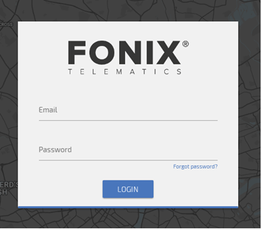
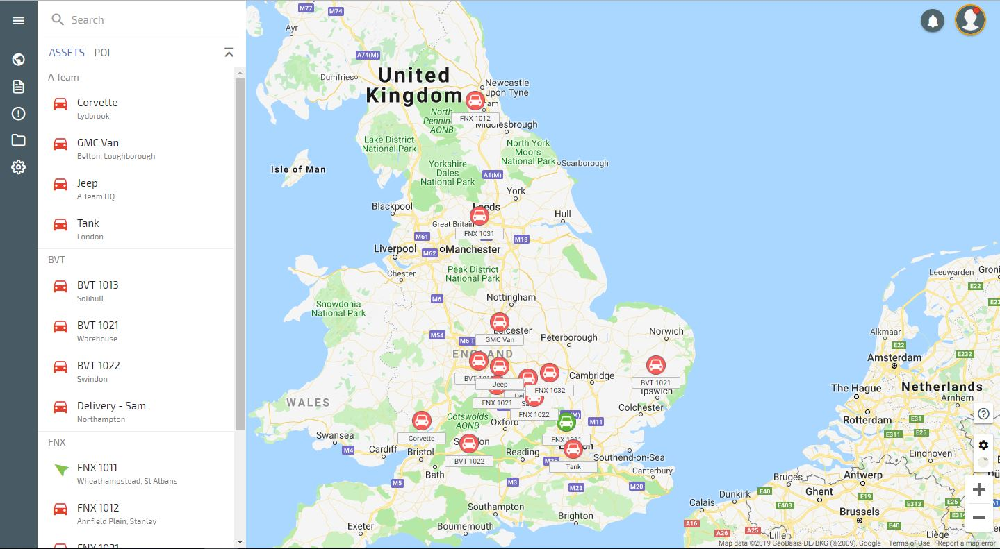

# Getting Started

Hello! 

Thanks for taking time to look at the Fonix Telematics user guide. Hopefully we will cover everything in this guide but if, for any reason, you can find what you are looking for then please do contact your managing partner via the 'Support' option under the profile tab within the system. 

## Compatible browsers

Our applications are compatible with most modern browsers. However, we do recommend you use **[Chrome]**(https://www.google.com/chrome/) or **[Firefox]**(https://www.mozilla.org/firefox/) for a better experience.

## Logging in

Go to web.fonixtelematics.com

Enter your email address and password in the appropriate box then click ‘Login’

This will open the tracking system and display your assets on the map

If you cannot log in for any reason, please email [support@fonixtelematics.com](mailto:support@fonixtelematics.com)

You will then be presented with the map screen

## Overview

General concepts.

<!--stackedit_data:
eyJoaXN0b3J5IjpbMTU1OTMyMTU2LC0zMjc2MDI4NjcsLTkxNT
U5NTQyMl19
-->