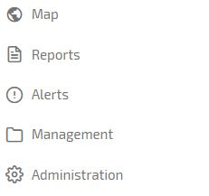

# Menu

If you click on 3 bar the menu icon in the top left you will be given the following options:

**Map** – Click here to return to the main tracking page when in other areas of the menu.

**Reports** – Click here to access reports.

**Alerts** – Click here to see alerts that have been triggered.

**Management** – Click here to manage journeys and change from Business to Private

**Administration** – Click here to set up or edit Assets, Drivers, POIs, Alerts, Users and Groups

There are also Menu Shortcut Icons on the home page and they are as follows:

<!--stackedit_data:
eyJoaXN0b3J5IjpbLTE2NDYwMzIxMDIsLTEyMDE1NDQ5ODddfQ
==
-->