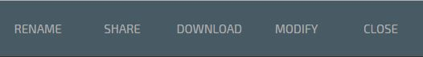
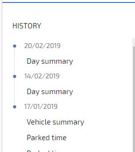
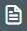

# Reports

## Run a Report

Select Reports from the main menu

[Report Icon](img/reports-icon.jpg)

Choose the report you wish to run

Select the assets to run the report for, or select All

Select the To and From dates

Enter an email address if you wish to have the report emailed.

Click the tick in the blue circle to run the report

Once the report has been run you have the option to print the report by clicking the below

You can also Export to CSV, Copy Link or Send By Email, or rename the report, these options are shown at the top of the report to the left

Reports you have run are stored in the ‘History’ section so they can be viewed without having to run the same report again

## Create Scheduled Report

Select Reports from the main menu

Click ‘ + ’ in bottom right corner which will open the Report Schedule Module Window

Choose Type – Once, Daily, Weekly, Monthly

Choose the report you wish to setup – Journey Summary, Parked Time etc

Select the assets you wish to include in the scheduled report

Enter the email addresses you wish to send the reports to

Select report format – PDF, HTML, CSV

To finish click ‘Save’

Click ‘ + ’ in bottom right corner which will open the Report Schedule Module Window

Choose Type – Once, Daily, Weekly, Monthly

Choose the report you wish to setup – Journey Summary, Parked Time etc

Select the assets you wish to include in the scheduled report

Enter the email addresses you wish to send the reports to

Select report format – PDF, HTML, CSV

To finish click ‘Save’

## View Scheduled Reports

Select Reports

Click Report Schedules

## Edit Scheduled Reports

Select Reports

Click Report Schedules

Select the report you wish to edit

Edit the feature you want to change

To finish click ‘Save’
<!--stackedit_data:
eyJoaXN0b3J5IjpbMTI1MTE3NTU3MCwzNjAzNDg4NDZdfQ==
-->