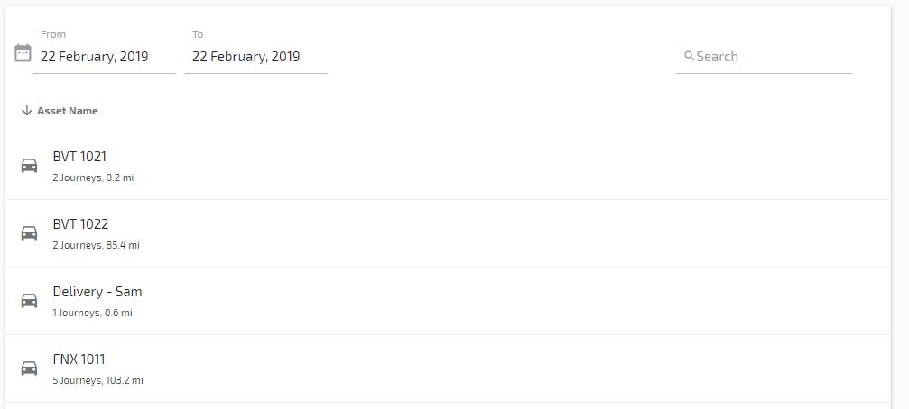
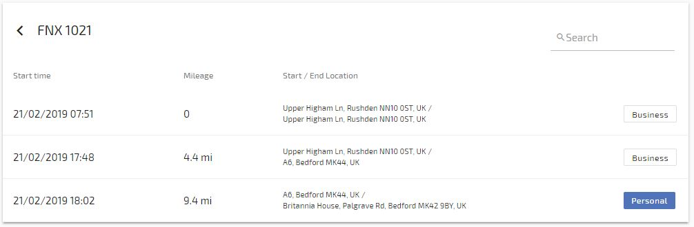

# Management

**Business/Private Journeys**

Select Management from the main menu

Here you will be presented with a list of assets and the number of journeys they have completed in that day. You can change the date by using the date selector at the top of the list of assets.

Clicking on an asset will show the journeys for that asset for that day.

Here you can select whether a journey should be classed as Private or Business by clicking on the relevant button.

<!--stackedit_data:
eyJoaXN0b3J5IjpbLTg4MjkwNzgwNCwtMTUzNDMyMDUzXX0=
-->