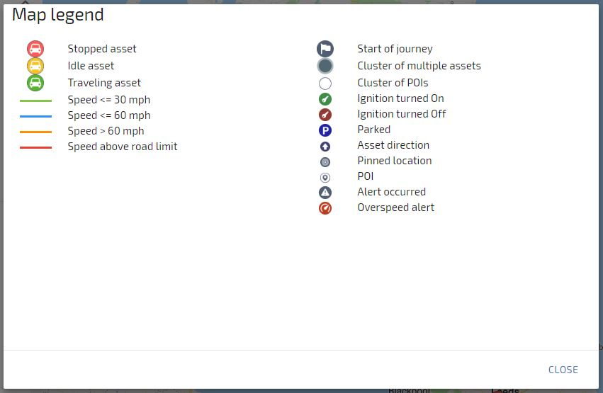
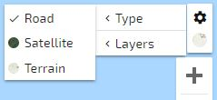
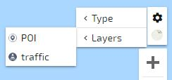
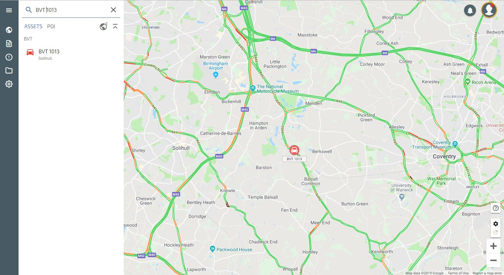

# Map

## Mapping Settings

In the bottom right hand corner of the map you will see the icons shown below

Clicking on the ? brings up the Map Legend as shown below, which explains the different icons:

The + and – symbols zoom the map in and out

The cog symbol brings up Type and Layers, Type gives you the map type views; Road, Satellite and Terrain. Clicking the icon below the cog reverts the Type back to the previous selection

Clicking on Layers allows you to select whether POI’s are shown on the map and you can also select the Traffic Overlay, which will overlay Google Traffic on the map

Traffic Layer enabled screen below

<!--stackedit_data:
eyJoaXN0b3J5IjpbLTc3Njg4NzA2OSwtMTY2MTUyMzEyNl19
-->