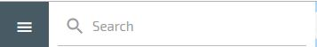
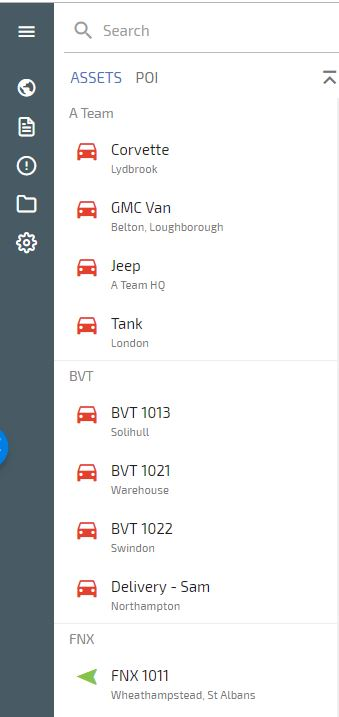

# Left Hand Menu

## Search Function

The Search function is located at the top of the left menu

You can use this to search for Assets, POI’s and Asset Groups

## Assets List

Your assets are listed alphabetically here

Click on the Asset Icon  to Zoom and centre the vehicle on the map

Click on the Asset Name
to Zoom and centre the vehicle on the map and open the vehicle summary, shown below

Here you can view the vehicle details, current location, the day’s journeys, and change the time and date to show previous journeys.

By clicking on ‘TODAY’ under the Google Street view image you can choose from Yesterday, Last 3 Days and Custom date range

By clicking on the clock under the Google Street view image you can choose a Start and End time for which to show journeys for:

Clicking on the Blue circle with the snail trail shows the snail trail for the whole day

The days journeys are displayed in a chart form as shown below, each blue bar represents a journey

Clicking on a journey brings up the snail trail for that journey and the journey details including start and finish addresses, mileage, duration and average speed

## POI (Point Of Interest) List 

Clicking on POI brings up the POI list, you can click on a POI to see the details and edit that POI.

See the POI section of this guide for creating, editing and deleting POI’s

<!--stackedit_data:
eyJoaXN0b3J5IjpbLTIxMjM5NDA2MzUsMTY1NzU5MzE0OCwtMT
E3NDMwOTA0NCw0Mjk0NTA4NjRdfQ==
-->