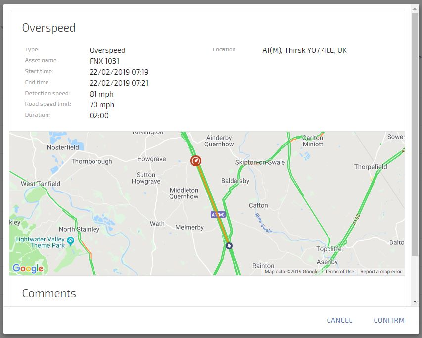

# Viewing Alerts

Select Alerts from the main menu

You will see a list of alerts, by clicking on one it will bring up the details on that alert shown below:

<!--stackedit_data:
eyJoaXN0b3J5IjpbMTQ4MTU3OTYwMywtMTc5ODcyODA2M119
-->